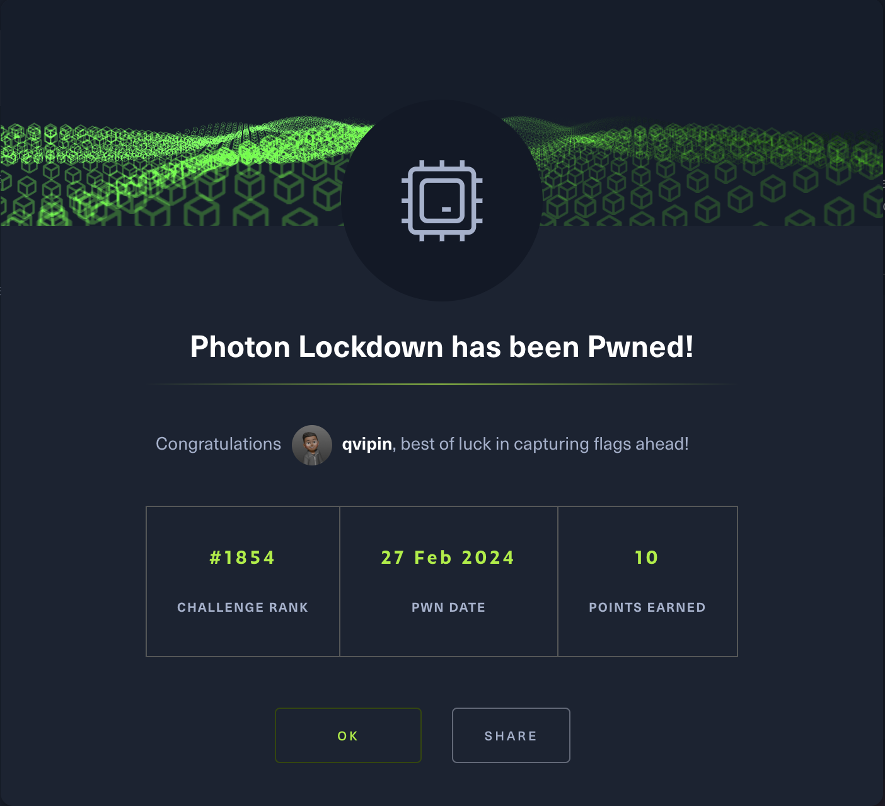

# NOTE: This was a blog from *vipin.xyz* see [this](https://www.vipin.xyz/blog/archive)


# HTB Photon Lockdown

A Hardware challenge by HackTheBox

Release: 2024-02-27

> Category: Hardware  
> Difficulty: Very Easy  
> Challenge Description:  
> "We’ve located the adversary’s location and must now secure access to their Optical Network Terminal to disable their internet connection. Fortunately, we’ve obtained a copy of the device’s firmware, which is suspected to contain hardcoded credentials. Can you extract the password from it?"

## Extracting `rootfs`

- Googling how to extract `rootfs` files tells us to use a tool called `squashfs`

```bash
❯ sudo unsquashfs rootfs

Parallel unsquashfs: Using 8 processors
865 inodes (620 blocks) to write

[=============================================================|] 1485/1485 100%

created 440 files
created 45 directories
created 187 symlinks
created 238 devices
created 0 fifos
created 0 sockets
created 0 hardlinks
```

## Finding the Flag

- We can use the `find` command plus `grep` for *"HTB"* to search for the flag. 

```bash
❯ find /Users/vipin/Downloads/ONT/squashfs-root -type f -exec grep -Hn "HTB" {} \;

Binary file /Users/vipin/Downloads/ONT/squashfs-root/bin/tc matches
Binary file /Users/vipin/Downloads/ONT/squashfs-root/bin/ip matches
/Users/vipin/Downloads/ONT/squashfs-root/etc/config_default.xml:244:<Value Name="SUSER_PASSWORD" Value="HTB{REDACTED}"/>
```

## CHALLENGE PWNED!

[](https://www.hackthebox.com/achievement/challenge/1573144/548)
<div style={{ textAlign: 'center' }}>
  <small>Fig.1 *PWNED*</small>
</div>